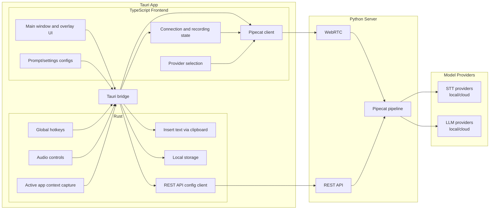

# Tambourine Architecture Diagram

This diagram focuses on ownership boundaries: which runtime is responsible for which features.

Last updated: February 11, 2026

## Caveats

- This is a simplified ownership diagram, not a full runtime sequence diagram.
- Arrows show primary responsibility and communication intent; they do not represent every code path.
- Some behaviors involve both Tauri events and Tauri commands; both are grouped under `Tauri bridge`.
- Server internals are intentionally collapsed (for example, provider switching, framing, and prompt assembly details).
- The architecture evolves frequently; update this document when flow or ownership changes.

## 1) Feature Ownership Diagram (High-Level)

## 2) Feature Ownership Matrix (High-Level)

| Feature Block (Diagram)        | Primary Owner              | Supporting Owner(s)          | Notes                                                                                      |
| ------------------------------ | -------------------------- | ---------------------------- | ------------------------------------------------------------------------------------------ |
| Global hotkeys                 | Rust backend               | TS frontend                  | Native shortcut trigger handling for start/stop style actions. Uses `tauri-plugin-global-shortcut` + Rust state machine. |
| Audio controls                 | Rust backend               | TS frontend                  | Native audio state/control functions exposed to the app flow. Uses Rust mic/audio modules + Tauri commands/events. |
| Insert text via clipboard      | Rust backend               | TS frontend                  | Final text insertion into the active target app. Uses Rust `type_text` command path. |
| Active app context capture     | Rust backend               | TS frontend + Python server  | Context captured natively and forwarded for server-side dictation behavior. Uses macOS Accessibility/NSWorkspace/CoreGraphics and Windows Win32/UIA. |
| Local storage                  | Rust backend               | TS frontend                  | Persistent local settings/history storage for app state. Uses `tauri-plugin-store` + Rust history storage. |
| REST API config client         | Rust backend               | Python server                | Rust-side client that syncs runtime config to server REST API. Uses `tauri-plugin-http` (`reqwest`). |
| Main window and overlay UI     | TS frontend                | Rust backend                 | User-facing surfaces and controls. Uses React + Mantine + Tauri WebView. |
| Connection and recording state | TS frontend                | Rust backend + Python server | Frontend orchestration of connect/recording UX state. Uses XState + React hooks. |
| Pipecat client                 | TS frontend                | Python server + Rust backend | Frontend realtime client connected to Python WebRTC path. Uses `@pipecat-ai/client-js` + `@pipecat-ai/small-webrtc-transport`. |
| Provider selection             | TS frontend                | Python server                | Selection starts in frontend and is sent through the WebRTC client path. Uses RTVI client messages over Pipecat data channel. |
| Prompt/settings configs        | TS frontend                | Rust backend + Python server | Config edits start in frontend, then flow via Tauri bridge and Rust REST client to server. Uses React Query + Tauri invoke + FastAPI config endpoints. |
| Tauri bridge                   | Rust backend + TS frontend | None                         | Internal TS↔Rust boundary for app communication (events/commands). Uses `@tauri-apps/api` `invoke` + `emit/listen`. |
| WebRTC                         | Python server              | TS frontend                  | Realtime app-server channel. Uses Pipecat SmallWebRTC transport + FastAPI offer/patch endpoints. |
| REST API                       | Python server              | Rust backend + TS frontend   | App-server config and metadata channel. Uses FastAPI + Pydantic request/response models. |
| Pipecat pipeline               | Python server              | TS frontend                  | Stream/frame orchestration for dictation runtime. Uses Pipecat `Pipeline`, `PipelineTask`, processors. |
| STT providers (local/cloud)    | Model providers            | Python server                | Speech-to-text inference backends used by pipeline. Uses Pipecat STT services (for example Whisper/Deepgram/etc.). |
| LLM providers (local/cloud)    | Model providers            | Python server                | LLM inference backends used by pipeline. Uses Pipecat LLM services (for example Ollama/OpenAI/etc.). |

## 3) Communication Channels

- `WebRTC`: real-time voice and control path between frontend client and Python server.
- `REST`: configuration and metadata path between app layers and Python server.
- `Tauri bridge`: internal bridge between Rust native features and TypeScript UI.
